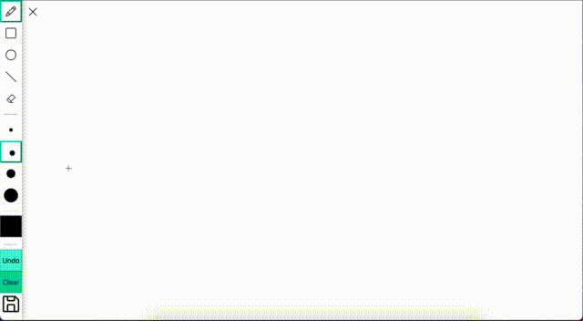
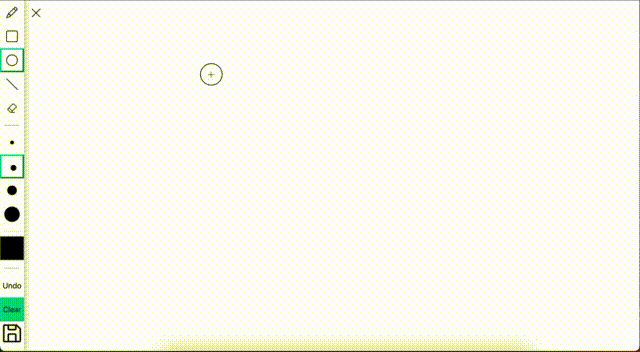
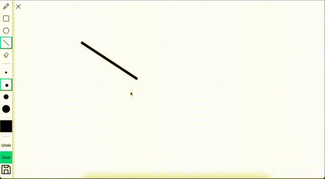
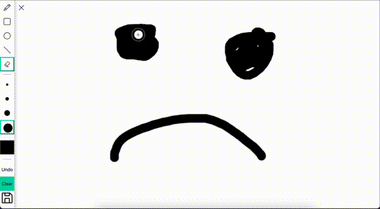
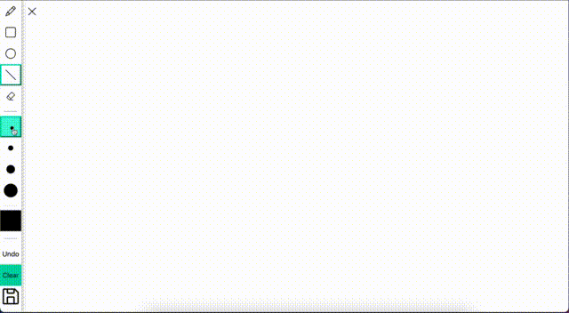
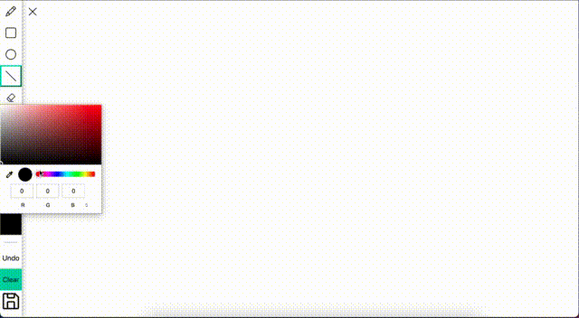
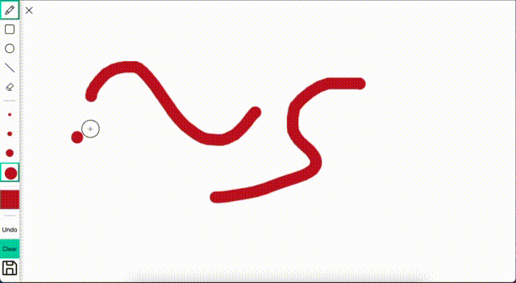
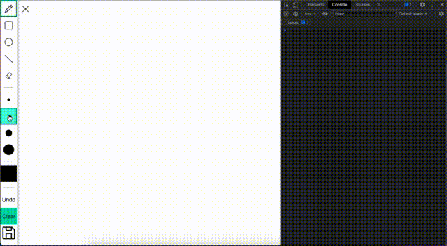
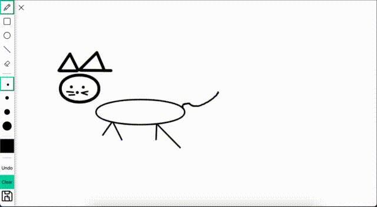

# Hackathon-Drawing-App

## Mintbean.io Junior Developer Hackathon

## Challenge Introduction

[Hackathon Brief](https://mintbean.io/meets/cfa4fa54-c706-4c51-a04f-671f6686f9fd/resources)

Build an app that lets people express their creativity in a visual format. You can build ANY application you'd like. Whether it's a blank canvas that you can paint on, a photo-editing app, a shared white board -- as long as it fulfills one OR both of the following requirements:

-   As a user, I can drag my mouse across the screen to make free-form lines.
-   As a user, I can click areas of the screen with my mouse to fill them with a color, texture or pattern.

## Live Site Link

[Live Site](https://squiggle-drawing-app.netlify.app/)

## How To Use

### Option 1

1. Visit the live site above.
2. On the top navigation you can find a button labeled _Squiggle Now_.
3. You can also find other call to action buttons to access the drawing app
4. Once on the application, you will have your tool menu on the left. This can be toggled open or close.
5. Now have fun and let your imagination run wild! (Use your mouse or touchpad, your cursor is your pen/pencil/brush)

### Option 2

Unfortunately we are not mobile friendly at this time. Our application works on desktop browsers only.

1. You can either clone the files of this repository or download the files to your local files.
2. Utilize VScode extension [Live Server](https://marketplace.visualstudio.com/items?itemName=ritwickdey.LiveServer) by Ritwick Dey to open the draw.html file.
3. Now have fun and let your imagination run wild! (Use your mouse or touchpad, your cursor is your pen/pencil/brush)

### Features

1. Free hand drawing.  
   
2. Draw shapes (Rectangles and Circles).  
   
3. Create straight lines.  
   
4. Erase parts of your drawing board and clear the entire board.
   
5. Choose from four different stroke widths/weight.
   
6. Pick from a wide range of colors using HEX / RGB / HSL.
   
7. Undo your last action.
   
8. Resize your canvas by resizing your browser window.
   
9. Download your drawing to your computer.
   

## Approach

We are both front-end developers at the time of this hackathon. Our team approached this by first discussing what technologies we should utilize based on our current technology experience. We then created a list of features we wanted to accomplish. We worked in one single repository and continuously branched from our main branch when building features out. Once completed, we would add, commit and push on to the current branch we were working on and review each other's code before merging. Although we were unable to fully reach our desired goal, we are happy with the final product as we were able to implement most of our planned features.

## Contributors

If you would like to know more about the application or have questions, please reach out to us through one of the following:

### Michael Tran

-   [Github](https://github.com/michaelhtran120)
-   [LinkedIn](https://www.linkedin.com/in/michaelhtran120/)
-   [Portfolio](https://www.michaelhtran.com)

### Yehan Nilanga

-   [Github](https://github.com/Yehan20)
-   [LinkedIn](https://www.linkedin.com/in/yehan-nilanga-552b87161/)

## Motivation & Reflection

### Michael Tran

My motivation for participating in this hackathon was focused on the experience of working with another developer. I am grateful for the opportunity because it pushed me to learn and apply the knowledge I have gained thus far. The highlight for me was knowing that I can read and understand another developer's logic in approaching a problem and its solution. This also gave me really good practice in refactoring to get both of our codes working efficiently together.

### Yehan Nilanga

My main motivation in participating was to gain more development experience outside of my projects. The knowledge I gained on working on a team, using Github and utilizing the Canvas API will be helpful for my future projects.
